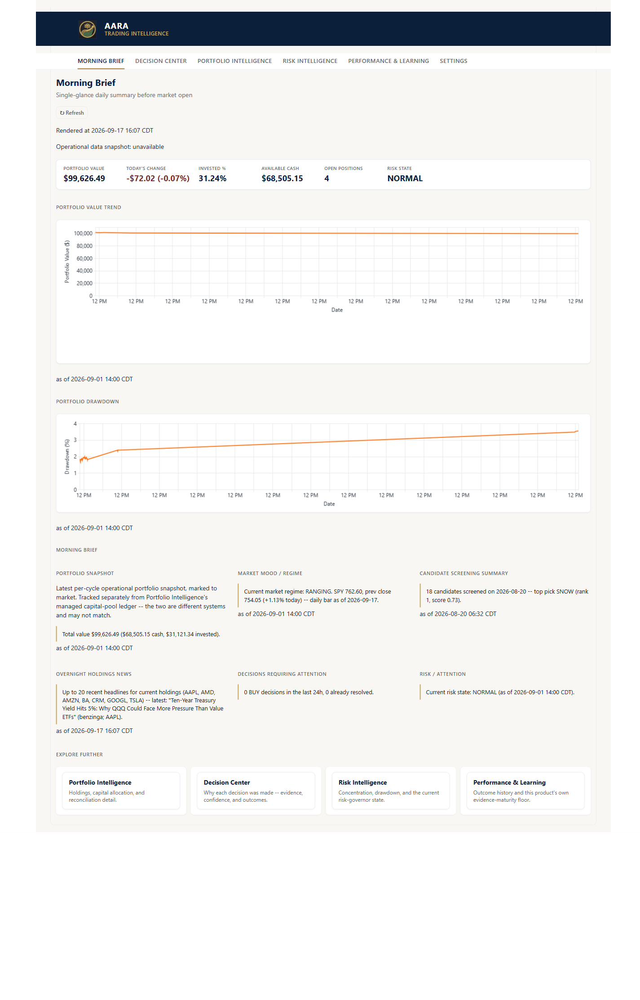
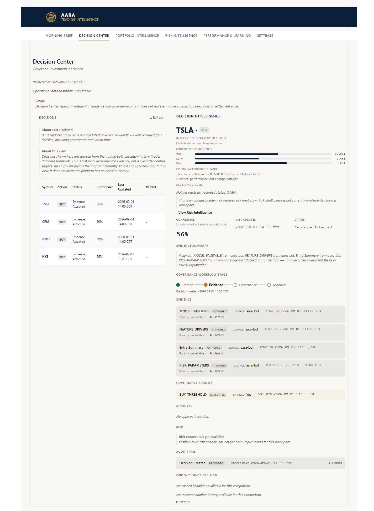
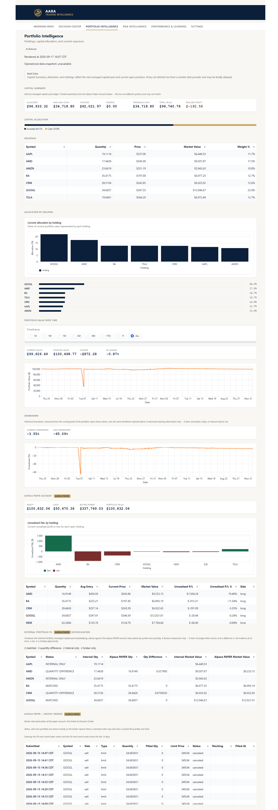
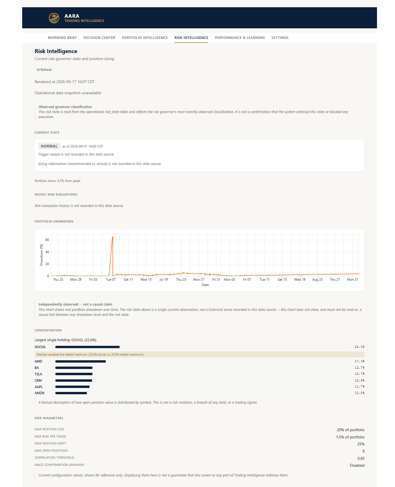
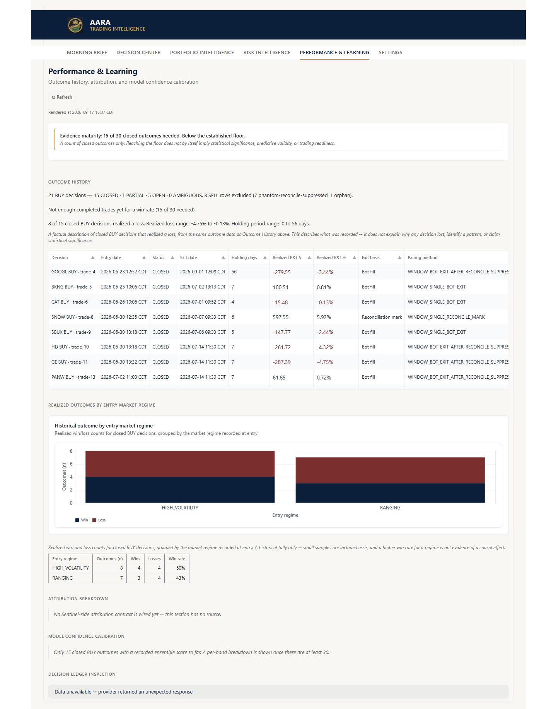
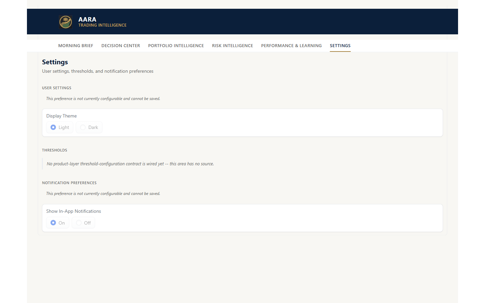
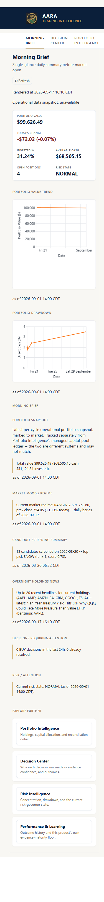
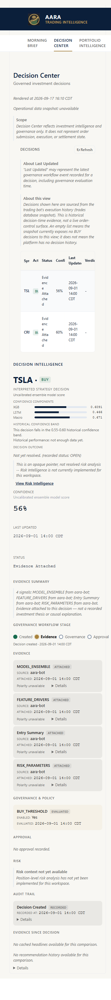

# AI Trading Bot / AARA — Sentinel Intelligence Platform

An autonomous paper-trading system (XGBoost + LSTM + PPO reinforcement-learning ensemble, governed by
a 10-gate signal filter and a hard-coded risk manager) that runs on a fully free stack (GitHub
Actions, HuggingFace Spaces, Alpaca paper trading). Built alongside it, on the same codebase: a
governance-first Decision Intelligence platform (**Sentinel Intelligence Engine**) with 71 Architecture
Decision Records, a 4,500+ test suite, and an explicit documentation hierarchy — because a system that
graduates to real money needs an audit trail for *why* it does what it does, not just code that works.

> **Status:** Paper trading only — real-money execution is gated behind the Confidence Check in §5,
> and has not been enabled. See `docs/decisions/` for the architectural decision history and
> `docs/SECURITY.md` for what "going live" is defined to require.

---

## Screens

The Trading Intelligence Decision Center — six screens, each grounded in real data through the
pipeline described in §3, not mock content.

| Morning Brief | Decision Center |
|---|---|
|  |  |

| Portfolio Intelligence | Risk Intelligence |
|---|---|
|  |  |

| Performance Learning | Settings |
|---|---|
|  |  |

Responsive down to mobile (Morning Brief and Decision Center shown; same treatment across all six):

| Morning Brief (mobile) | Decision Center (mobile) |
|---|---|
|  |  |

---

## 1. What's Actually Here

Two things share this repository, at different levels of maturity — stated plainly, not blurred:

| Layer | What it is | Maturity |
|---|---|---|
| **The trading bot** (`bot/`, `dashboard/`, `.github/workflows/`) | A working, scheduled (every 5 min, market hours) paper-trading system with a public Gradio dashboard. Frozen against casual modification by [ADR-002](docs/decisions/ADR-002-bot-runtime-protection.md). | Production (paper) |
| **Sentinel Intelligence Engine** (`sentinel_engine/`) + **Trading Intelligence** (`applications/trading_intelligence/`) | A governance-first Decision Intelligence platform being built alongside the bot — `Decision`/`Evidence`/`Event` domain contracts, a 6-screen Decision Center UI (Morning Brief, Decision Center, Portfolio/Risk Intelligence, Performance Learning, Settings), and an ADR-driven architecture process. Read-only today: it observes and explains, it does not yet influence execution ([ADR-066 §6](docs/decisions/ADR-066-sentinel-decision-evidence-domain-vocabulary-ratification.md)). | Active development |

Both are real code with real tests — this isn't a vision doc ahead of an empty package. `sentinel_engine/` alone is 72 production modules across domain, services, evidence, governance, ledger, projections, adapters, and composition layers.

## 2. Documentation

`docs/README.md` is the full index (20+ documents). The ones worth knowing about first:

| Document | Why it matters |
|---|---|
| [`docs/DOCUMENT_INDEX.md`](docs/DOCUMENT_INDEX.md) | The documentation hierarchy itself — what's binding, what's a draft, and the reading order for finding the canonical source on any topic. |
| [`docs/decisions/`](docs/decisions/) | 71 ADRs — every structural decision (package boundaries, ledger ownership, identity model) recorded with context, alternatives, and an explicit acceptance step. Not a changelog; a decision record. |
| [`docs/SECURITY.md`](docs/SECURITY.md) | Trust boundaries, per-credential blast radius, and a concrete checklist for what real-money execution requires before it's enabled. |
| [`docs/TEST_STRATEGY.md`](docs/TEST_STRATEGY.md) | Why a stochastic system (ML predictions drift every retrain) can't be unit-tested the normal way, and what actually gates a model's promotion to production. |
| [`docs/RUNBOOK.md`](docs/RUNBOOK.md) | What's monitored, what each alert means, and the incident procedure for the risks in `RISK_REGISTER.md`. |
| [`docs/GLOSSARY.md`](docs/GLOSSARY.md) | One lookup table for the vocabulary spanning both layers (`regime`, `risk gate`, `Decision`, `Evidence`, `Trust Ledger`, `Capability API`, ...). |
| [`docs/DOCUMENT_GOVERNANCE_MATRIX.md`](docs/DOCUMENT_GOVERNANCE_MATRIX.md) + [`docs/DOCUMENT_CONSOLIDATION_PLAN.md`](docs/DOCUMENT_CONSOLIDATION_PLAN.md) | A self-audit of the documentation tree itself (134 documents at last count) and a phased plan to fix what it found — duplicate content, disagreeing authority claims, stale status labels. Governance that includes auditing its own overhead, not just producing more of it. |

## 3. Trading Bot Architecture

Data flows strictly downward — upper layers don't reach into lower ones.

```
Layer 1 — Data Ingestion      bot/strategy/features.py, macro.py, sentiment.py (FinBERT + Reddit)
Layer 2 — Regime Classification    bot/strategy/regime_classifier.py  (TRENDING_UP / RANGING / ...)
Layer 3 — Signal Generation   xgb_predictor.py, lstm_predictor.py, rl_agent.py (PPO) → ensemble.py
                               → signal_gate.py (10-gate entry filter)
Layer 4 — Risk Management     bot/risk/risk_manager.py — daily/weekly loss limits, PDT guard,
                               drawdown circuit breaker, Kelly position sizing, stop-loss
Layer 5 — Execution           bot/execution/alpaca_client.py — limit orders, fill confirmation
Layer 6 — Monitoring          bot/monitor/ — Telegram alerts, HuggingFace sync, dashboard data
```

```
GitHub Actions (cron, every 5 min, market hours)
    └─► bot/main.py → per-symbol cycle (signals → gates → risk → execute)
            └─► sync_db.py → HuggingFace Dataset (trades.db)

HuggingFace Spaces (dashboard/app.py, always-on)
    └─► reads trades.db (read-only — no path back to Alpaca; see docs/SECURITY.md §1)
```

Full detail: [`docs/ARCHITECTURE.md`](docs/ARCHITECTURE.md).

## 4. Hard-Coded Risk Rules (verified against `config.py`, not aspirational)

| Rule | Value | Enforced in |
|---|---|---|
| Max position size | 20% of portfolio | `MAX_POSITION_PCT`, `risk_manager.py` |
| Stop-loss (flat fallback) | 4% | `STOP_LOSS_PCT` |
| Daily loss limit | 5% (halts new trades) | `DAILY_LOSS_LIMIT_PCT` |
| Max sector exposure | 30% of portfolio | `MAX_SECTOR_EXPOSURE_PCT` |
| Max positions per sector | 2 | `MAX_SECTOR_POSITIONS` |
| Max open positions | 8 | `MAX_POSITIONS` |
| PDT day-trade guard | ≤ 3 per rolling 5 days | `PDT_MAX_DAY_TRADES` |

Manual emergency stop: touch `data/HALT_TRADING` — see [`docs/RUNBOOK.md`](docs/RUNBOOK.md) §2.

## 5. Confidence Check — Gate to Real Money

Real-money execution does not turn on by developer discretion — it's gated behind measured targets in
[`docs/SUCCESS_METRICS.md`](docs/SUCCESS_METRICS.md), checked via:

```bash
python scripts/confidence_check.py
```

| Metric | Target |
|---|---|
| Win rate | ≥ 60% |
| Sharpe ratio | ≥ 1.0 |
| Max drawdown | ≤ 12% |
| Return vs. S&P 500 | Beat by ≥ 5pp |
| AI recommendation follow rate | ≥ 70% |

The plan beyond this gate is Alpaca paper trading now, graduating to a funded Robinhood account for
real-money execution — not Alpaca live. See `docs/SECURITY.md` §5 for what that transition requires
before it happens.

## 6. Setup

```bash
git clone <this-repo>
pip install -r requirements.txt
cp .env.example .env   # fill in the keys below
python backtest/engine.py
python bot/main.py --mode paper
```

Required secrets (full inventory with outage handling: [`docs/EXTERNAL_SERVICES.md`](docs/EXTERNAL_SERVICES.md)):

| Secret | Purpose |
|---|---|
| `ALPACA_KEY`, `ALPACA_SECRET` | Paper trading + market data |
| `FRED_API_KEY` | Macro signals (VIX, T-bill) |
| `NEWSAPI_KEY` | FinBERT sentiment input |
| `REDDIT_CLIENT_ID`, `REDDIT_CLIENT_SECRET`, `REDDIT_USER_AGENT` | WSB sentiment weighting |
| `FINNHUB_API_KEY` | Screener analyst signals |
| `TELEGRAM_TOKEN`, `TELEGRAM_CHAT_ID` | Trade/risk alerts |
| `HF_TOKEN`, `HF_DB_REPO_ID` | Trade-history push (bot) — the dashboard's own pull uses `HF_REPO_ID`; these are two different variables for two different directions, see `docs/EXTERNAL_SERVICES.md` |

## 7. Verifying This Repo's Claims Yourself

```bash
pytest -q                                        # 4,538 tests repo-wide (tests/ + sentinel_engine/ + applications/)
python tests/ui_tester.py                        # design-system compliance, target 0 FAIL 0 WARN
python tests/requirements_tracker.py --status    # feature completion tracker
python tests/requirements_tracker.py --docs-check  # verifies every managed doc exists and README links resolve
```

## 8. Disclaimer

Educational project. Algorithmic trading carries real financial risk. Paper trading extensively
before risking capital; nothing here is financial advice.

## License

All rights reserved — see [LICENSE](LICENSE). Shared publicly for portfolio and review purposes;
viewing is welcome, but no reuse, redistribution, or commercial use is licensed.
